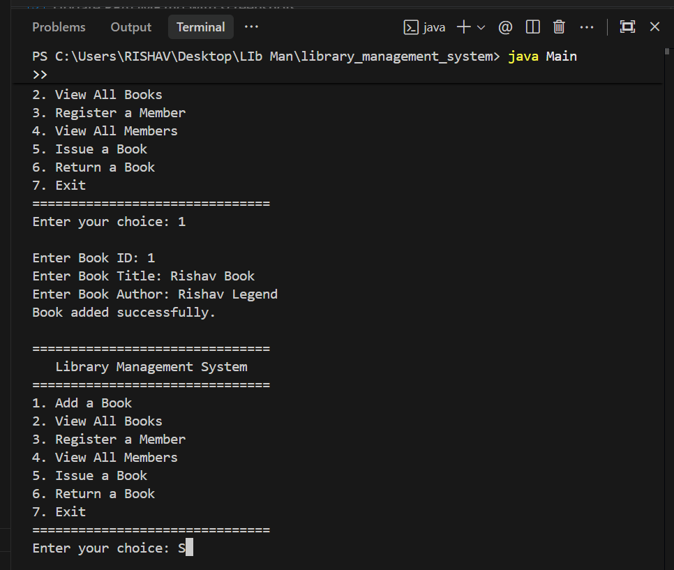
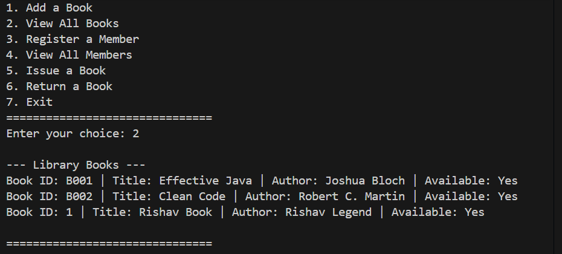
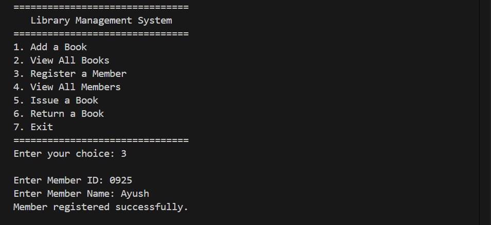

# Library Management System

A console-based Library Management System built using Java and Object-Oriented Programming (OOP) principles. 

## Features

- **Add a Book**: Add new books to the library with an ID, title, and author.
- **View All Books**: List all available and issued books in the library.
- **Register a Member**: Register new members using a unique ID and name.
- **View All Members**: View all registered library members.
- **Issue a Book**: Link a book to a member for borrowing.
- **Return a Book**: Unlink a book from a member when they return it.

## Getting Started

### Prerequisites

- Java Development Kit (JDK) 8 or higher.

### Running the Application

1. Clone this repository.
2. Compile the Java files:
   ```bash
   javac *.java
   ```
3. Run the main class:
   ```bash
   java Main
   ```

## Project Structure

- `Main.java` - Entry point containing the console-based UI.
- `Library.java` - Manages books, members, and issue/return logic.
- `Book.java` - Represents a book entity.
- `Member.java` - Represents a library member entity.
- `Transaction.java` - Handles book issuing and returning transactions.
- `LibraryItem.java` - Base class or interface for library items.
- `LibraryException.java` - Custom exception handling for library errors.

## Screenshots

Here are some screenshots of the application:

### Screenshot 1


### Screenshot 2


### Screenshot 3

